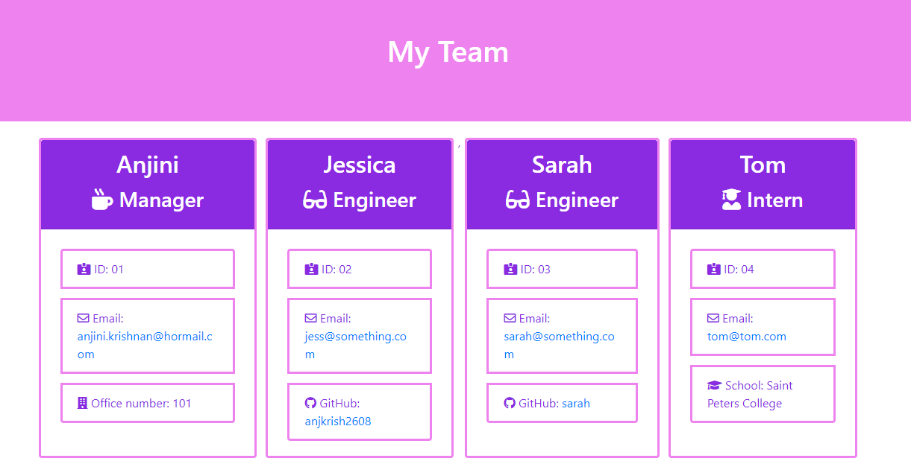

# Employee Summary
Below is an example of the output of the application, the file can be accessed [here](output/team.html).




[Click here to view the live example output.](https://anjkrish2608.github.io/employeeSummary/output/team.html)

[Click here to view repository.](https://github.com/anjkrish2608/employeeSummary)

[Click here to view a video of the application functioning.](https://drive.google.com/file/d/1WO7gNZV8USGhKwzZ8ZH-sVZbRKCZoBk2/view)

## Table of Contents

* [Description of Application](#des)
* [Technologies Used](#tech)
* [Challenges Faced](#chall)
* [Features to be Implemented](#dev)
* [Installation Steps](#insta)
* [Tests](#tests)
* [How to Use](#use)
* [Credits](#cred)

<a id="des"></a>

## Description of Application
The Readme Generator is a CLI application which prompts the user for information which is then outputted in the form of a team website. The motivation behind the creation of this application is to automate the process of creating a team website with profiles for each employee. An example output of this application is attached to the repository. Throughout the creation of this application I have learned how to use functions to create an ordered prompt sequence.

<a id="tech"></a>

## Technologies Used
While creating this application I have used many different technologies listed below:

* JavaScript ES6 : to write all of the code inside app.js
* Node JS : to run the app.js file
* Inquirer Package : to ask the user for input
* Fs Package : to write the html file

<a id="chall"></a>

## Challenges Faced
Throughout the creation of this application I have faced many challenges. The main challenge I faced was due to initially focusing on using the inquirer recursive prompt package. However this would not function correctly on my computer resulting in relying on the multiple functions to correctly order the prompts and loop through them.

<a id="dev"></a>

## Features to be Implemented
In the future I would like to implement the more creative CSS styling and limit the number of employees per row.


<a id="insta"></a>

## Installation Steps
1. Download Node.js
2. Download apps.js to a folder.
3. Run the terminal in that folder and write the following commands:
```
npm init
npm install
npm install inquirer
```
4. Then run the app.js file using the command
```
node app.js
```

<a id="tests"></a>

## Tests
To test the application ensure the test folder is downloaded and run the following command in the terminal.
```
npm run test
```

<a id="use"></a>

## How to Use
After following the Installation steps you will be prompted with a series of questions, answer accordingly and inside the folder there should be a new file named \"team.html\" in the output folder which you can then upload to your application's repository.

<a id="cred"></a>

## Credits
As mentioned in [Technologies Used](#tech) the following assets were used:
* [JavaScript ES6](https://www.javascript.com/)
* [Node JS](https://nodejs.org/en/)
* [Inquirer Package](https://www.npmjs.com/package/inquirer)
* [Fs Package](https://www.npmjs.com/package/fs)
Furthermore the requirements set for this application were supplied by Trilogy Education Services.

© 2019 Trilogy Education Services, a 2U, Inc. brand. All Rights Reserved.